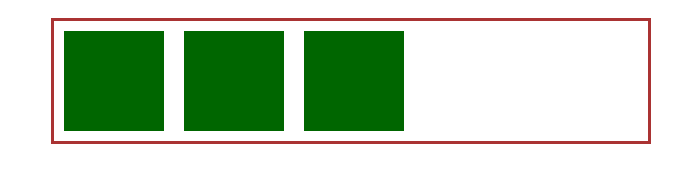
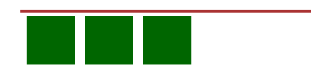

### 1. display:none、visibility:hidden、opacity:0 三者的异同点
+ 三者都会隐藏对应的元素
+ display:none 对应的元素不会在文档流中占据空间，它的子元素也会隐藏，它的使用会引起重绘和回流，同时也不能绑定事件
+ visibility:hidden 对应的元素依旧在文档流中占据空间，它的子元素可以用过设置visibility:visible显示，它的使用只会引起重绘，同时也不能绑定事件
+ opacity:0 对应的元素依旧在文档流中占据空间，它的子元素也会隐藏，它的使用只会引起重绘，同时可以绑定事件

### 2. 简单选择器
+ div p 后代选择器：选择包含在`<div>`之中的**所有**`<p>`标签
+ div > p 子元素选择器：只选择属于`<div>`**子元素**的`<p>`标签
+ div + p 相邻选择器：选择紧接在`<div>`之后的**第一个同级**`<p>`标签
+ div ~ p 匹配选择器：选择紧接在`<div>`之后的**所有同级**`<p>`标签

### 3. CSS选择器特殊性权重
+ 选择器的特殊性值表述为4个部分，用0,0,0,0表示
    + 行间样式：1,0,0,0
    + ID选择器：0,1,0,0
    + 类选择器、属性选择器、伪类：0,0,1,0
    + 元素：0,0,0,1
    + !important比较特殊，可以将其特殊性理解为：1,0,0,0,0，拥有最高特殊性
+ 当特殊性相同时，后声明的样式会覆盖先声明的样式
+ 伪类遵循爱恨原则(LVHA)，即伪类想要同时生效，需要按照:link :visited :hover :active的顺序排列

### 4. CSS中触发GPU加速的属性
+ transform
+ opacity
+ filter

### 5. 响应式布局
GitHub上有一个讲解非常清晰和详实：https://github.com/forthealllight/blog/issues/13

### 6. CSS盒模型
+ 标准盒模型
<br>
+ IE盒模型
<br>

### 7. link与@import
+ link引入CSS示例
    ```html
     <link rel="stylesheet" rev="stylesheet" href="CSS文件" type="text/css" media="all" />
    ```
+ @import引入CSS示例
    ```html
    <style type="text/css" media="screen"> 
        @import url("CSS文件"); 
    </style> 
    ```
+ link和@impor区别
    + link是HTML提供的标签，不仅可以加载CSS，还可以定义rel等属性
    <br>@import是css提供的语法，只有导入样式表的作用
    + link引入的CSS在页面加载时同时被加载
    <br>@import引入的CSS要等页面加载完毕后再加载
    + link是HTML提供的语法，不存在兼容性问题
    <br>@import是CSS2.1提供的语法，IE5以上才兼容
    + JS控制DOM时，可以通过插入link标签来改变样式，但无法通过@import改变样式

### 8. Flex布局
阮一峰有篇博客非常详尽的介绍了Flex布局的相关知识：http://www.ruanyifeng.com/blog/2015/07/flex-grammar.html

### 9. 画一条0.5px的线
+ 直接设置0.5px
<br>每个浏览器展现出来的情况不同，因此不推荐这种做法
+ 使用scale缩放
    ```css
    .example {
        height: 1px;
        transform: scaleY(0.5);
        transform-origin: 50% 100%;  // Chrome需要添加此行才能正常显示
    }
    ```
+ 利用box-shadow属性
    ```css
    .example {
        height: 1px;
        background: none;
        box-shadow: 0 0.5px 0 #000;
    }
    ```
+ viewport
    ```html
    <meta name="viewport" content="width=device-width,initial-sacle=0.5">
    ```
    本方法虽然可以让1px的线变为0.5px，但是会影响整个页面的缩放比，加大UI和前端的沟通难度

### 10. 实现垂直居中
+ 使用margin: auto
    ```css
    .example {
        position: absolute;
        top: 0;
        bottom: 0;
        left: 0;
        right: 0;
        margin: auto;
    }
    ```
+ margin设置为负值
    ```css
    .example {
        width: 200px;
        height: 200px;
        position: absolute;
        top: 50%;
        left: 50%;
        margin-left: -100px;
        margin-top: -100px;
    }
    ```
+ 父元素设置为table-cell
    ```css
    .father {
        display: table-cell;
        vertical-align: middle;
    }
    .son {
        vertical-align: middle;
    }
    ```
+ 利用flex布局
    ```css
    .example {
        display: flex;
        align-items: center;
        justify-content: center;
    }
    ```

### 11. 块级元素和行内元素
+ 块级元素
<br>块级元素会独占一行，不能与其他任何元素并列，能接受宽高，如果不设置宽度，那么宽度将默认为父级的100%
<br>常见的块级元素：所有的容器级标签，例如`div h1 h2 ul ol li`等，还有p标签也是块级元素
+ 行内元素
<br>行内元素与其他行内元素并排，不能设置宽高，默认的宽度就是文字的宽度
<br>常见的行内元素：所有的文本级标签，例如`span a b i u`等，p标签是块级元素不是行内元素
+ 块级元素和行内元素的相互转换
<br>对块级元素设置`display:inline`可以将其转换为行内元素，对行内元素设置`display:block`可以将其转换为块级元素
+ display:inline-block
<br>`display:inline-block`可以让元素具有块级元素和行内元素的特性，既可以设置长宽并让padding和margin生效，又可以和其他行内元素并排，是一个很实用的属性。

### 12. 外边距折叠
+ 什么是外边距折叠
<br>在CSS中，两个或多个毗邻的普通流中的块级元素（可能是父子元素，也可能是兄弟元素）在垂直方向上的外边距会发生叠加，这种形成的外边距称之为外边距叠加。
<br>关键字：`毗邻` `两个或多个` `普通流` `垂直方向`
+ 折叠之后的大小
    + 两个margin值都为正数：折叠后的值为其中较大的margin值
    + 两个margin值都为负数：折叠后的值为其中绝对值较大的margin值
    + 两个margin值都为一正一负：折叠后的值为两个margin值相加之后的值
+ 如何消除外边距折叠
<br>破坏上述四个关键条件 `毗邻` `两个或多个` `普通流` `垂直方向` 中的任意一个即可
    + 浮动元素、绝对定位元素、inline-block元素不会与其他任何元素发生外边距重叠
    + 形成BFC的元素不会与它的子元素发生外边距重叠
    + 其他方法详见W3C的总结 https://tech.youzan.com/css-margin-collapse/

### 13. position属性
阮一峰有一篇博客非常详细的讲解了position属性：http://www.ruanyifeng.com/blog/2019/11/css-position.html

### 14.清除浮动
当我们想要在一个父元素中添加几个子元素并给他们设置float的时候，会发现父元素的高度会塌陷
<br>
<br>希望展现的效果
<br>
<br>
<br>实际展现的效果
<br>
<br>
<br>针对上述情况，我们有以下几种办法清除浮动
+ 直接为父元素设置高度
<br>这种方法的优点在于可以快速的解决问题而且简单粗暴，但缺点是设置的高度必须和子元素高度相同，只适合于高度完全固定的场景，极其缺乏灵活性，因此不推荐使用
+ 设置`clear:both`的冗余元素
    ```html
    <div class="father">
            <div class="child"></div>
            <div class="child"></div>
            <div class="child"></div>
            <!--冗余的子元素-->
            <div style="clear:both;"></div>
    </div>
    ```
    在父元素之后添加一个冗余元素并在其样式中设置`clear:both`，该方法的优点是简单快捷，但确定是如果页面中有很多需要清除浮动的位置则需要设置很多的冗余元素，实现麻烦且语义化差
+ 为父元素设置伪元素属性
    ```html
    <div class="father fix">
                <div class="child"></div>
                <div class="child"></div>
                <div class="child"></div>
    </div>
    ```
    ```css
    .fix::after { 
            content:"."; 
            display:block; 
            height:0; 
            visibility:hidden; 
            clear:both;
    }
    ```
    当需要清除浮动时，只需要给相应的父元素追加fix类就能达到清除浮动的效果，实现起来非常简单同时又符合语义化的要求，**推荐使用**
+ 为父元素设置`overflow:hidden`
    ```html
    <div class="father fix" style="overflow:hidden;">
                <div class="child"></div>
                <div class="child"></div>
                <div class="child"></div>
    </div>
    ```
    为父元素添加`overflow:hidden`会触发BFC效果，因此也能够清除浮动，但本方法有可能影响其他布局效果，因此也不推荐使用


