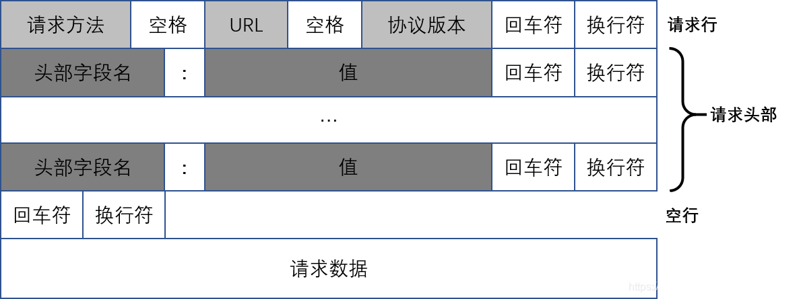

### HTTP请求中的GET和POST方法
+ HTTP的请求报文
<br>GET和POST都是HTTP协议中最为常用的两种请求方法，其他的请求方法还包括HEAD/PUT/DELETE/TRACE/CONNECT/OPTIONS，一共八种，他们的具体描述如下：

    | 请求方法 | 描述 |
    | :---: | :--- |
    | GET | 请求指定的页面信息，并返回实体主体 |
    | POST | 向指定资源提交数据进行处理请求，数据包含在请求体中，POST请求可能会导致资源的建立或修改 |
    | HEAD | 类似于GET请求，只不过返回的响应中没有具体的内容，用于获取报头 |
    | PUT | 从客户端向服务器传送数据取代指定文档的内容 |
    | DELETE | 请求服务器删除指定的页面 |
    | TRACE | 回显服务器收到的请求，主要用于测试或诊断 |
    | CONNECT | HTTP/1.1协议中预留给能够将连接改为管道方式的代理服务器 |
    | OPTIONS | 允许客户端查看服务器的性能 |

+ 请求方法如何使用
<br>HTTP的请求报文结构如下图所示

<br>可以看到 HTTP 的请求报文由三部分构成：
    + 请求行：由请求方法、URL和版本号组成，其中的空格、回车符和换行符均不可省略，请求方法位于请求行中。
    + 请求头部：位于请求行之后，可以有0至若干个，每个请求头部都包含一个头部字段名和一个值，它们之间用冒号`:`分隔，在最后用回车符和换行符表示结束。
    + 请求数据：如果请求方法为GET，那么请求数据为空，如果请求方法为POST，则可以将表单等数据放在请求数据内发送给服务器。

+ GET请求具体示例
    ```http request
    GET /search/users?q=JakeWharton HTTP/1.1
    Host: api.github.com
    Connection: keep-alive
    Upgrade-Insecure-Requests: 1
    User-Agent: Mozilla/5.0 (Windows NT 10.0; WOW64) AppleWebKit/537.36 (KHTML, like Gecko) Chrome/73.0.3683.86 Safari/537.36
    Accept: text/html,application/xhtml+xml,application/xml;q=0.9,image/webp,image/apng,*/*;q=0.8,application/signed-exchange;v=b3
    Accept-Encoding: gzip, deflate, br
    Accept-Language: zh-CN,zh;q=0.9
    Cookie: _octo=GH1.1.1623908978.1549006668; _ga=GA1.2.548087391.1549006688; logged_in=yes; dotcom_user=GoMarck; _gid=GA1.2.17634150.1554639136; _gat=1
    ```
    从请求行中可以看到请求方法是GET，URL为`/search/users?q=JakeWharton`，协议版本号是HTTP1.1，请求行之下是请求头部，分别列出了host、连接方式、浏览器版本等信息，同时由于是GET请求因此没有请求数据。

+ POST请求具体示例
    ```http request
    POST / HTTP/1.1
    Host: www.wrox.com
    User-Agent: Mozilla/5.0 (Windows; U; Windows NT 5.1; en-US; rv:1.7.6)
    Gecko/20050225 Firefox/1.0.1
    Content-Type: application/x-www-form-urlencoded
    Content-Length: 40
    Connection: Keep-Alive
    
    name=Professional%20Ajax&publisher=Wiley
    ```
    从请求行中可以看到请求方法是POST，URL为空，协议版本号也是HTTP1.1，上面GET方法例子不一样的地方在于它的请求参数是位于请求数据中的，即`name=Professional%20Ajax&publisher=Wiley`。

+ GET方法的特点
    + GET方法会将请求的数据会附在URL之后，以?分割URL和需要传输数据，多个参数用&连接，但也可以使用其他符号进行连接，视服务器能够识别的情况而定。
    + 根据HTTP规范，GET主要用于信息获取，其具有安全性和幂等性的特点
        + 安全性指的是该操作用于获取信息而非修改信息。换句话说，GET请求一般不应产生副作用，它仅仅是获取资源信息，就像数据库查询一样，不会修改或增加数据，不会影响资源的状态。
        + 幂等性则指的是无论调用这个URL多少次，都会返回相同的结果。而在实际过程中，这个规定没有那么严格，例如访问一个新闻网站，新闻会实时更新，但并不妨碍方法的幂等性。
    + GET方法会被浏览器主动缓存，如果下一次传输的数据相同，那么浏览器就会从缓存中直接提取内容，以求更快地展示数据。
    + GET方法的URL一般都具有长度限制。但是需要注意的是**HTTP协议中并未规定GET请求的长度，这个长度限制主要是由浏览器和服务器所决定的**，并且各个浏览器对长度的限制也各不相同。
    + GET方法只产生一个TCP数据包，浏览器会把请求头和请求数据一并发送出去，服务器响应`200 ok`并返回数据。

+ POST 方法的特点
    + 根据HTTP规范，POST可能修改变服务器上的资源，因此是不具备安全性和幂等性的。
    + 虽然POST方法将请求信息放在请求数据中，而GET方法直接将请求信息拼接在URL上，但是POST方法并不因此而比GET方法安全，因为HTTP都是明文传输，请求方法的安全性需要HTTPS协议来保障。
    + POST方法的请求信息是放在请求数据中的，所以它的请求信息是没有长度限制的。
    + 通常情况下，POST方法会产生两个TCP数据包，浏览器会先将请求行和请求头部发送给服务器，待服务器响应`100 continue`后，浏览器再发送请求数据，随后服务器响应`200 ok`并返回数据。
    + 并非所有浏览器都会将POST方法中的header和body分开发送，例如**Chrome和Firefox在数据量较小的情况下会将header和body一起发送**，因此POST方法的发送形式还是看浏览器的具体特性。

+ GET和POST的区别
<br>GET方法和POST方法在本质上其实是一样的，他们都是基于TCP协议的请求方法，在实际操作过程中，给GET加上请求数据，给POST加上URL参数，其实都是可行的，但HTTP规范不建议我们这么做。
<br>将HTTP请求分为不同类型的目的在于**便于管理**，单纯获取资源的请求就规定为GET、修改服务器资源的请求就规定为POST，其他请求方法也有自己的作用，并且也对不同方法的报文格式也做出了相应的要求。


