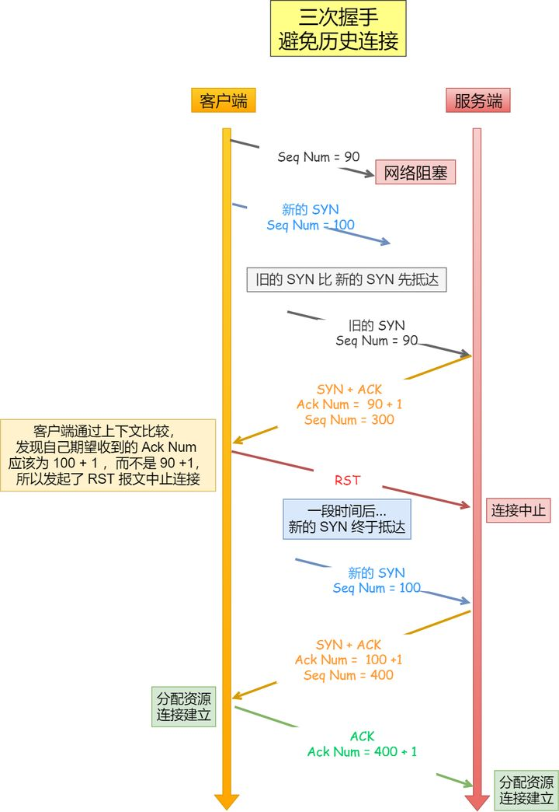
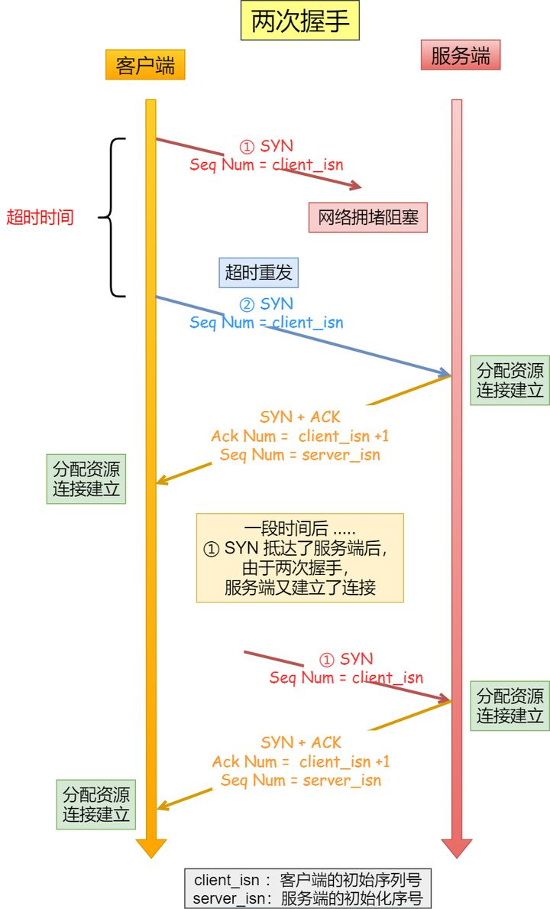
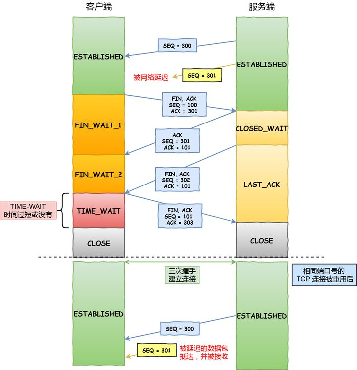
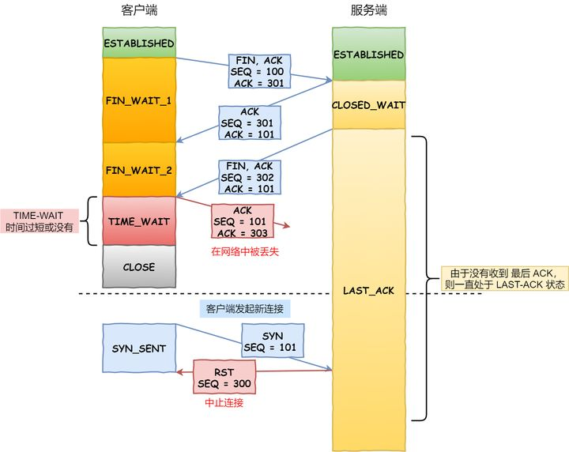

### TCP连接的三次握手与四次挥手
+ 三次握手
    1. 发送端首先发送一个带**SYN**标志的数据包给接收方
    2. 接收端收到后，回传一个带有**SYN/ACK**标志的数据包以示传达确认信息
    3. 最后，发送端再回传一个带**ACK**标志的数据包，代表握手结束
+ 三次握手的意义
    1. 第一次握手
        + 发送端：无法确认任何状态
        + 接收端：对方发送=>自己接收
    2. 第二次握手
        + 发送端：自己发送=>对方接收 && 对方发送=>自己接收
        + 接收端：对方发送=>自己接收
    3. 第三次握手
        + 发送端：自己发送=>对方接收 && 对方发送=>自己接收
        + 接收端：自己发送=>对方接收 && 对方发送=>自己接收
+ 三次握手中，最后一次回复丢失，会发生什么
    + 如果最后一次ACK在网络中丢失，那么服务器会根据TCP的超时重传机制依次等待3秒、6秒、12秒后重新发送SYN/ACK报文，以便客户端重新发送ACK报文
    + 如果重发指定次数后，仍然未收到ACK应答，那么一段时间后服务器会自动关闭这个连接
    + 如果客户端认为此连接已经建立并向服务器发送数据，服务器将发送RST响应，而后客户端将获悉第三次握手失败
+ 为什么要握手三次(进阶)
    + 阻止重复历史连接的初始化(主要原因)
     
    + 避免资源浪费
     
    + 同步双方的初始序列号
     当客户端发送携带「初始序列号」的SYN报文的时候，需要服务端回一个ACK应答报文，表示客户端的SYN报文已被服务端成功接收，那当服务端发送「初始序列号」给客户端的时候，依然也要得到客户端的应答回应，这样一来一回，才能确保双方的初始序列号能被可靠的同步
+ 四次挥手
    1. 主动断开方发送**FIN**报文，用以关闭主动断开方与被动断开方的数据传输，同时进入`FIN_WAIT_1`状态
    2. 被动断开方收到**FIN**报文，然后回复一个**ACK**报文进行确认，同时进入`CLOSED_WAIT`状态，主动断开方接收到**ACK**报文后，进入`FIN_WAIT_2`状态
    3. 被动断开方处理完需要发送的数据后，也发送一个**FIN**报文，用以关闭被动断开方到主动断开方的数据传输，同时进入`LAST_ACK`状态
    4. 主动断开方收到**FIN**报文后，也回复一个**ACK**报文进行确认，然后进入`TIME_WAIT`状态
    5. 被动断开方接收到**ACK**报文后，进入`CLOSE`状态，主动断开方在等待2MSL时间后也进入`CLOSE`状态，至此四次挥手完成，连接彻底断开
+ 为什么握手是三次，挥手却要四次
    + 建立连接时，服务器在收到建立连接请求的SYN报文后，把SYN和ACK放在一个报文里发送给客户端，而断开连接时服务器会**把FIN和ACK分别发送**，因此比握手时会多一次挥手
    + 服务器收到FIN报文后，客户端虽不再发送数据但仍可以接收数据，因此服务器可以选择继续发送数据而后再关闭连接，即**先发送ACK报文再发送FIN报文**，因此比握手时会多一次挥手
+ 为什么客户端最后需要有一个时长2MSL的TIME_WAIT状态(进阶)
    + MSL Maximum Segment Lifetime 即报文最大生存时间，Linux系统中，MSL默认是30秒，2MSL就是60秒
    + TIME_WAIT作用1：防止旧连接的数据包
    
    + TIME_WAIT作用2：保证连接正确关闭
    