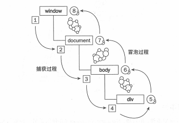

### 1. addEventListener
addEventListener的重点主要是其第三个参数 target.addEventListener(type, listener[, useCapture]) 即最后一个useCapture参数是false或true的问题，false代表在冒泡阶段执行，true代表在捕获阶段执行DOM事件流如下（JavaScript高级程序设计）



总结如下：
+ true的触发顺序总是在false前面
+ 如果多个均为true，则外层触发先于内层
+ 如果多个均为false，则内层触发先于外层

### 2. setTimeout()
setTimeout()是一个异步处理函数，它会等待所有的主线程任务处理完，才开始执行自己的内部的任务。所以如果其中包含var定义的变量，setTimeout()处理它时会选取该变量最后的值，而如果是其中包含let定义的变量，则setTimeout()依旧会选择let绑定时的值。

### 3. e.target和e.currentTarget
+ e.target获取的是触发该事件的元素，也就是点击事件绑定了ul，但是点了ul里面的li，那么target指的是li
+ e.currentTarget获取的是绑定事件的元素，虽然点击的是ul的子元素li，但是currentTarget获取的是ul

### 4. JS数组方法
+ 会改变原数组的方法：push、pop、shift、unshift、splice、reverse、forEach、sort
+ 不会改变原数组的方法：filter、concat、slice、map

### 5. typeof、Object.prototype.toString、instanceof
+ typeof方法返回一个字符串，来表示数据的类型，各数据类型所对应的typeof返回值如下：

| 数据类型 | typeof返回值 | 基本or引用 |
| :---: | :---: | :---: | 
| Undefined | "undefined" | 基本数据类型 |
| Null | "object" | 基本数据类型 |
| 布尔值 | "boolean" | 基本数据类型 |
| 数值 | "number" | 基本数据类型 |
| 字符串 | "string" | 基本数据类型 |
| Symbol | "symbol" | 基本数据类型 |
| 宿主对象 | Implementation-dependent |
| 函数 | "function" | 引用数据类型 |
| 任何其他对象 | "object" | 引用数据类型 |

+ 但typeof往往不足以判断一些细分类型，例如数组、正则、日期、对象的typeof返回值都是object，此时需要用到另一个判断类型的方法Object.prototype.toString，各类型对应的返回值如下：

| 数据类型 | 返回值 |
| :---: | :---: |
| 数组 | Array |
| 日期 | Date |
| 错误 | Error |
| 正则表达式 | RegExp |

+ instanceof运算符可以用来判断某个构造函数的prototype属性是否存在于另外一个要检测对象的原型链上，以下是一些简单的例子：
```javascript
// 定义构造函数
function C(){} 
function D(){} 

var o = new C();

// true，因为 Object.getPrototypeOf(o) === C.prototype
o instanceof C; 

// false，因为 D.prototype不在o的原型链上
o instanceof D; 

o instanceof Object; // true,因为Object.prototype.isPrototypeOf(o)返回true
C.prototype instanceof Object // true,同上

C.prototype = {};
var o2 = new C();

o2 instanceof C; // true

o instanceof C; // false,C.prototype指向了一个空对象,这个空对象不在o的原型链上.

D.prototype = new C(); // 继承
var o3 = new D();
o3 instanceof D; // true
o3 instanceof C; // true
```


### 6. 判断一个数据是不是Array的方法
+ Array.isArray(obj) ==>> ES5中的方法，在IE8或之前版本中使用会有问题
+ obj instanceof Array ==>> 判断不同window或iframe里构造的数组时会失败，因为原型链断裂
+ Object.prototype.toString.call(obj) == '[object Array]' ==>> 较为靠谱的方法
+ obj.constructor === Array ==>> constructor返回的是创建此对象的函数


