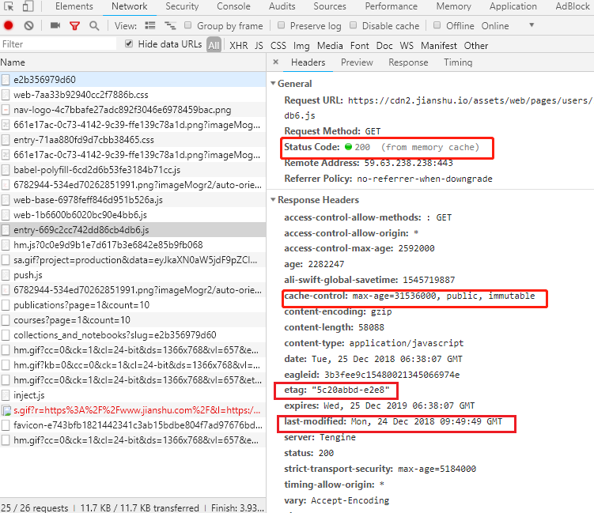

### 强缓存与协商缓存
+ 什么是缓存
 浏览器缓存是浏览器将用户请求过的静态资源存储到电脑本地磁盘中，当浏览器再次访问时便可以直接从本地加载而无需再次从服务器请求，其优点主要有：
    + 减少冗余数据传输，节省网络开销
    + 减轻服务器负担，提升网站性能
    + 加快客户端加载网页的速度

+ 缓存设置参数
 
    + Status Code&nbsp;&nbsp;&nbsp;&nbsp;状态码
    + cache-control&nbsp;&nbsp;&nbsp;&nbsp;缓存相关设置
        + max-age&nbsp;&nbsp;&nbsp;&nbsp;过期时间
        + public&nbsp;&nbsp;&nbsp;&nbsp;浏览器和代理服务器都可以缓存
        + private&nbsp;&nbsp;&nbsp;&nbsp;仅浏览器可以缓存
        + no-cache&nbsp;&nbsp;&nbsp;&nbsp;不进行强缓存
        + no-store&nbsp;&nbsp;&nbsp;&nbsp;不进行任何缓存
        + immutable&nbsp;&nbsp;&nbsp;&nbsp;用户刷新页面也不对服务器发起请求
    + etag&nbsp;&nbsp;&nbsp;&nbsp;文件hash编码，每个文件唯一
    + last-modified&nbsp;&nbsp;&nbsp;&nbsp;文件的修改时间，精确到秒

+ 强缓存
 若cache-control中设置了max-age且时间没有过期，同时没有设置no-cache和no-store，则该资源匹配强缓存，从上图Static Code中显示的`200 (from memory cache)`中可以看出该资源来自于强缓存

+ 协商缓存
 当max-age过期或是设置了no-cache时，指定资源便会匹配协商缓存，协商缓存会向服务器发送请求，其中有两个属性发挥了重要作用：
    + etag：文件的唯一hash值，若文件发生变动则该值也会改变
    + last-modified：文件的修改时间，精确到秒
    
    每次请求返回来response header中的etag和last-modified，在下次请求时会添加到request header中，服务器会由此判断资源是否更改了，如果有过更改就返回新的资源，并更新对应的etag和last-modified

+ 为什么需要etag
 在HTTP1.1之前只有last-modified属性而没有etag属性，etag的出现是为了解决只有last-modified时存在的问题，其原因主要有以下两点：
    + 一些文件也许会周期性的更改，但是他的内容并不改变(仅仅改变的修改时间)，这个时候我们并不希望客户端认为这个文件被修改了，而重新请求资源
    + 某些文件修改非常频繁，比如在秒以下的时间内进行修改，last-modified能检查到的粒度是秒级的，这种修改无法判断
    + 某些服务器不能精确的得到文件的最后修改时间

+ 强缓存与协商缓存的区别

    | 缓存类型 | 状态码 | 是否请求服务器 |
    | :---: | :---: | :---: |
    | 强缓存 | 200 (from disk cache) | 否，直接从缓存取 |
    | 协商缓存 | 304 | 是，但是经服务器判断后未更新资源 |
    | 更新资源 | 200 | 是，经服务器判断后更新了资源 |

+ 用户行为对缓存的影响

    | 用户行为 | cache-control | etag & last-modified |
    | :---: | :---: | :---: |
    | 地址栏输入 | 有效 | 有效 |
    | 页面链接跳转 | 有效 | 有效 |
    | 新开窗口 | 有效 | 有效 |
    | 前进回退 | 有效 | 有效 |
    | F5刷新 | **无效** | 有效 |
    | Ctrl+F5强制刷新 | **无效** | **无效** |

