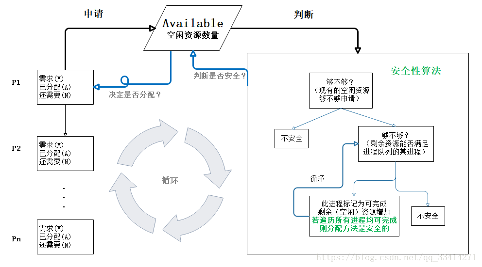

### 什么是死锁
死锁是指多个进程循环等待彼此占有的资源而无限期的僵持等待下去的局面。

### 死锁产生的原因
+ 系统提供的资源太少了，远不能满足并发进程对资源的需求。
+ 进程推进顺序不合适，互相占有彼此需要的资源，同时请求对方占有的资源，往往是程序设计不合理。

### 死锁产生的必要条件
+ 互斥条件：即某个资源在一段时间内只能由一个进程占有，不能同时被两个或两个以上的进程占有。
+ 不可抢占条件：进程所获得的资源在未使用完毕之前，资源申请者不能强行的从资源占有者手中夺取资源，而只能由该资源的占有者进程自行释放。
+ 占有且等待条件：进程至少已经占有了一个资源，但又申请了一个新的被其他进程所占有的资源，此时处于等待状态。
+ 循环等待条件：若干个进程形成环形链，每个都占用对方申请的下一个资源。

### 死锁的处理策略
为使系统不发生死锁，必须设法破坏产生死锁的四个必要条件之一，或者允许死锁产生，但当死锁发生时能检测出死锁，并有能力实现恢复。一般有死锁预防、死锁避免、死锁检测与恢复三种方法。
+ #### 死锁预防
    + 打破互斥条件：允许进程同时访问资源，缺点是部分资源无法同时访问。
    + 打破不可抢占条件：例如给进程设置优先级，高优先级的可以抢占资源等，缺点是实现起来较为复杂且会影响系统性能。
    + 打破占有且等待条件：实行资源预分配策略，即进程在运行前一次性的向系统申请它所需要的全部资源，缺点是会降低资源的利用率和并发性。
    + 破坏循环等待条件：把资源事先分类编号，所有进程对资源的请求必须严格按资源序号提出，使进程在申请占用资源时不会形成环路，缺点也是实现起来较为困难，同事会降低资源的利用率。
+ #### 死锁避免
    系统在进行资源分配前应先判断此次资源分配的安全性，若此次分配会导致系统进入不安全状态，则不予分配资源，让进程进入等待状态。**银行家算法**便是著名的死锁避免算法。

+ #### 死锁的检测
    构建进程-资源分配图，对进程-资源图进行简化，消除能够顺利执行的所有请求边和分配边，若最后所有进程都成为孤立的点，则说明系统没有死锁，反之则系统发生了死锁。
    
+ #### 死锁的恢复
    + 资源剥夺法：挂起某些死锁进程并剥夺它的资源，将这些资源分配给其他的死锁进程。
    + 进程撤销法：强制撤销一个或一部分进程并剥夺这些进程的资源，撤销的原则可以按进程的优先级和撤销进程代价的高低来进行。
    + 进程回退法：让一个或多个进程回退到足以回避死锁的地步，进程回退时便会将占有的资源释放。

### 银行家算法
当一个进程申请使用资源的时候，银行家算法先**试探**分配给该进程资源，然后通过安全性算法判断分配后的系统是否处于安全状态，若不安全则试探分配作废，让该进程继续等待。

 

银行家算法中资源被分为以下几种情况：

+ 进行P所需要的最大资源数量 MAX
+ 已分配给该进程的资源 Allocation
+ 还需要的资源数量 Need
+ 空闲的资源数量 Available

银行家算法基本原理是，假设资源P1申请资源，若Need <= Available，银行家算法便将资源试探性的分配给它，然后假设P1执行完毕后将所占用的资源全部释放，则可以继续判断进程队列中的其他进程，寻找到一个安全的执行顺序，如此就可避免系统存在潜在死锁的风险。

若还有不清楚的地方可以阅读以下博客，对银行家算法有简明扼要的讲解：https://qyliang.blog.csdn.net/article/details/80245715

