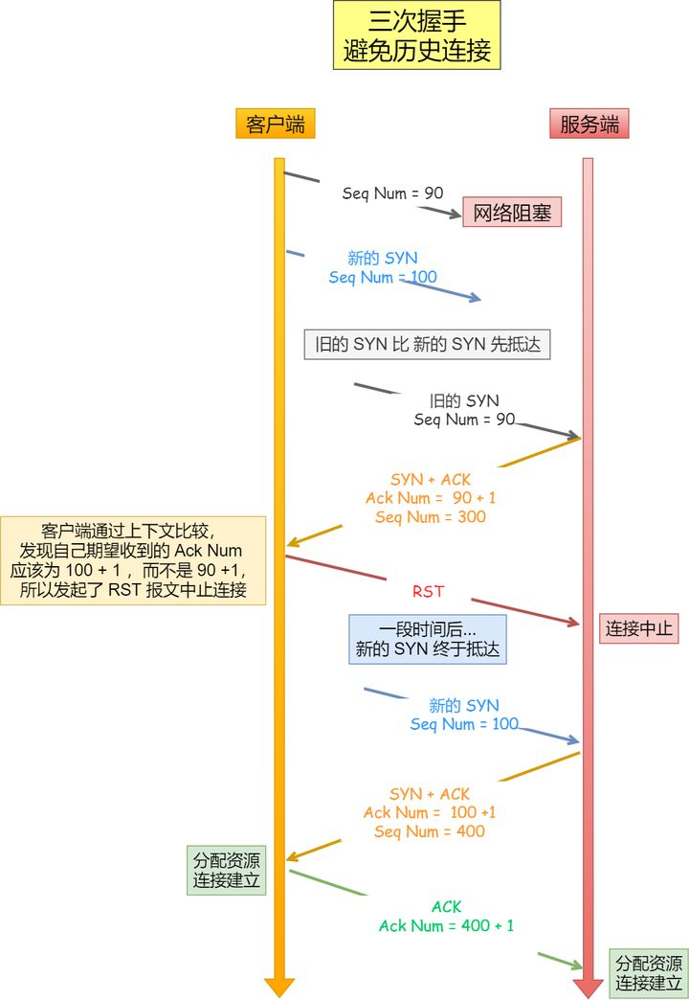

网络知识可以看GitHub一个项目的总结，相当全面，链接地址：
 https://github.com/huyaocode/webKnowledge/tree/master/2-%E8%AE%A1%E7%AE%97%E6%9C%BA%E5%9F%BA%E7%A1%80/%E7%BD%91%E7%BB%9C

### 1. cookie、localStorage、sessionStorage的异同点

| 相关特性 | cookie | localStorage | sessionStorage |
| :---: | :---: | :---: | :---: |
| 数据生命周期 | 一般由服务器生成，可以设置失效时间 若在浏览器生成，关闭浏览器之后失效 | 除非被清除否则永久保存 | 仅在当前对话有效 关闭浏览器或页面便会失效|
| 数据存储空间 | 4KB | 5MB | 5MB |
| 与服务器通信 | 每次都会携带在HTTP头中 cookie保存过多数据会带来性能问题 | 仅在客户端保存 不提交给服务器 | 仅在客户端保存 不提交给服务器 |
| 用途 | 一般由服务器生成，用于标识用户身份 | 用于浏览器存放缓存数据 | 用于浏览器存放缓存数据 |

相同点：三者都可以在浏览器端储存数据，都是字符串类型的键值对

### 2. TCP、UDP 简述
+ TCP（Transmission Control Protocol），又叫传输控制协议。 TCP协议是面向连接的，可靠的，基于字节流的传输协议。在基于TCP进行通信时，通信双方需要先建立一个TCP连接，TCP只支持1对1。
+ UDP（User Datagram Protocol），又叫用户数据报协议。 UDP是一个无连接的、不可靠、基于数据报的传输协议，UDP支持1对1和1对多。UDP只是报文（报文可以理解为一段段的数据）的搬运工，不会对报文进行任何拆分和拼装操作。
+ TCP UDP皆为传输层协议

### 3. HTTP常见状态码
+ 2XX 成功
    + **200 OK**
    + 201 Created 通常指POST请求的结果，已在服务器上成功创建了一个或多个新资源
    + 202 Accepted 表示已接受处理请求，但处理尚未完成，表异步
    + 204 No content，表示请求成功，但响应报文不含实体的主体部分
    + 205 Reset Content，表示请求成功，但响应报文不含实体的主体部分，但是与204响应不同在于要求请求方重置内容
    + **206 Partial Content，进行范围请求**
+ 3XX 重定向
    + **301 永久性重定向，表示资源已被分配了新的URL**
    + **302 临时性重定向，表示资源临时被分配了新的URL**
    + 303 表示资源存在着另一个URL，应使用GET方法获取资源
    + **304 未修改，重定位到浏览器。自从上次请求后，请求的网页未修改过，因此不对网页进行重新加载，进而节省带宽和开销**
    + 307 临时重定向，和302含义类似，但是期望客户端保持请求方法不变向新的地址发出请求
+ 4XX 客户端错误
    + 400 请求报文存在语法错误
    + 401 Unauthorized， 表示请求没有被认证，或者认证不正确请重新认证和重试
    + **403 Forbidden，用户被认证后，用户没有被授权在特定资源上执行操作的权限**
    + **404 在服务器上没有找到请求的资源**
+ 5XX 服务器错误
    + **500 表示服务器端在执行请求时发生了错误**
    + 501 表示服务器不支持当前请求所需要的某个功能
    + **503 表明服务器暂时处于超负载或正在停机维护，无法处理请求**

### 4. IPv4与IPv6
+ IPv4 地址由32位二进制数组成，IPv6由128位二进制数组成

### 5. cookie与session
+ cookie：服务器通过set-cookie将cookie信息返回给浏览器，浏览器将cookie信息保存在本地，下次向服务器发送请求时会带上所保存的cookie信息，服务器通过cookie识别浏览器，返回准确的用户信息
+ session：浏览器第一次发送请求时，服务器会生成一个HashTable和其唯一标识sessionID，之后用cookie返回sessionID到浏览器，之后浏览器再次向服务器发送请求时会利用cookie带上sessionID，以在服务器中找到对应的HashTable
+ cookie存在浏览器，session存在服务器
+ 由于cookie在本地，因此cookie安全性较低，易于伪造
+ cookie每次HTTP请求都会带上，影响网络性能，session则会耗费大量服务器资源

### 6. 从输入网址到网页展现发生了什么
1. **解析域名**：需要交域名转换为IP地址，首先检查浏览器缓存，然后检查本地hosts文件，之后检查路由器缓存，最后利用DNS服务器进行查找
2. **发起TCP连接**：客户端与服务器建立TCP连接，连接过程需要三次握手
3. **发送HTTP请求**：TCP连接建立之后，客户端像服务器发送HTTP请求，报文格式为：请求行+请求头+空行+消息体，其中请求方式包括：GET/POST/PUT/DELETE/等
4. **响应HTTP请求**：接收到HTTP请求后，服务器会对请求进行响应，报文格式为：状态行+响应头+空行+消息体，状态行包括HTTP版本号、状态码、状态说明等
5. **浏览器绘制页面**：浏览器根据接收到的文件开始绘制页面，首先根据HTML文件构建DOM树，然后利用CSS文件渲染DOM树，确定HTML中各元素位置大小的过程称作reflow(回流)，其后的绘制过程称作repaint(重绘)，在HTML页面绘制的过程中如遇到JS文件还需要交绘制过程挂起，优先执行JS文件的加载
6. **加载其他资源**：如需加载其他地址的内容，浏览器会重复之前的步骤，下载资源并将他们加载到网页中

### 7. HTTP/2 与 HTTP/3
有一篇公众号文章对此进行了很详细的介绍：https://mp.weixin.qq.com/s/QMMENNIKjeyvFnOt4eWIzQ
+ HTTP/1 的缺陷：
    + 由于对头阻塞造成带宽无法被充分利用
    + HTTP头部的体积巨大
    + 明文传输导致的不安全性
    + 不支持服务器推送消息
+ HTTP/2 的改进：
    + 将请求和响应等数据都分割为更小的帧，采用二进制编码进行传输
    + 利用"HPACK"算法对头部进行压缩，每次请求都只发送有更新的差异数据
    + 利用多路复用技术，将同一域名下的通信都放在一个TCP连接中，并支持任意数量的双向数据流
    + 服务器可以主动向客户端推送数据，减少等待延时
+ HTTP/3 新特性：
    + 将TCP替换为UDP+QUIC，并在UDP上实现了流量控制和传输可靠性，达到了0RTT建连
    + 在同一连接中使用多个独立的数据流进行数据传输，彻底告别对头阻塞

### 8. HTTP与HTTPS
HTTPS是以安全为目标的HTTP通道，简单讲是HTTP的安全版，HTTPS在HTTP的基础上加入了SSL协议，SSL依靠证书来验证服务器的身份，并为浏览器和服务器之间的通信加密。
+ HTTPS协议的主要作用
    + 建立一个信息安全通道，来保证数据传输的安全
    + 确认网站的真实性
+ HTTP和HTTPS的主要区别
    + https协议需要到ca申请证书，因而需要一定费用
    + http和https使用的是完全不同的连接方式，用的端口也不一样，前者是80，后者是443
+ HTTPS的工作原理
    1. 客户使用https的URL访问Web服务器，要求与Web服务器建立SSL连接
    2. Web服务器收到客户端请求后，会将网站的证书信息（证书中包含公钥）传送一份给客户端
    3. 客户端的浏览器与Web服务器开始协商SSL连接的安全等级，也就是信息加密的等级
    4. 客户端的浏览器根据双方同意的安全等级，建立会话密钥，然后利用网站的公钥将会话密钥加密，并传送给网站
    5. Web服务器利用自己的私钥解密出会话密钥
    6. Web服务器利用会话密钥加密与客户端之间的通信
+ HTTPS的缺点
    + HTTPS协议握手阶段比较费时，会使页面的加载时间延长近50%
    + HTTPS连接缓存不如HTTP高效，会增加数据开销和功耗
    + SSL证书需要钱，功能越强大的证书费用越高
    + SSL证书通常需要绑定IP，不能在同一IP上绑定多个域名
    + HTTPS协议的加密范围也比较有限，在黑客攻击、拒绝服务攻击、服务器劫持等方面几乎起不到什么作用。最关键的，SSL证书的信用链体系并不安全，特别是在某些国家可以控制CA根证书的情况下，中间人攻击一样可行

### 9. TCP连接的三次握手与四次挥手
+ 三次握手
    1. 发送端首先发送一个带**SYN**标志的数据包给接收方
    2. 接收端收到后，回传一个带有**SYN/ACK**标志的数据包以示传达确认信息
    3. 最后，发送端再回传一个带**ACK**标志的数据包，代表握手结束
+ 三次握手的意义
    1. 第一次握手
        + 发送端：无法确认任何状态
        + 接收端：对方发送=>自己接收
    2. 第二次握手
        + 发送端：自己发送=>对方接收 && 对方发送=>自己接收
        + 接收端：对方发送=>自己接收
    3. 第三次握手
        + 发送端：自己发送=>对方接收 && 对方发送=>自己接收
        + 接收端：自己发送=>对方接收 && 对方发送=>自己接收
+ 三次握手中，最后一次回复丢失，会发生什么
    + 如果最后一次ACK在网络中丢失，那么服务器会根据TCP的超时重传机制依次等待3秒、6秒、12秒后重新发送SYN/ACK报文，以便客户端重新发送ACK报文
    + 如果重发指定次数后，仍然未收到ACK应答，那么一段时间后服务器会自动关闭这个连接
    + 如果客户端认为此连接已经建立并向服务器发送数据，服务器将发送RST响应，而后客户端将获悉第三次握手失败
+ 为什么要握手三次(进阶)
    + 阻止重复历史连接的初始化(主要原因)
     
    + 避免资源浪费
     
    + 同步双方的初始序列号
     当客户端发送携带「初始序列号」的SYN报文的时候，需要服务端回一个ACK应答报文，表示客户端的SYN报文已被服务端成功接收，那当服务端发送「初始序列号」给客户端的时候，依然也要得到客户端的应答回应，这样一来一回，才能确保双方的初始序列号能被可靠的同步
+ 四次挥手
    1. 主动断开方发送**FIN**报文，用以关闭主动断开方与被动断开方的数据传输，同时进入`FIN_WAIT_1`状态
    2. 被动断开方收到**FIN**报文，然后回复一个**ACK**报文进行确认，同时进入`CLOSED_WAIT`状态，主动断开方接收到**ACK**报文后，进入`FIN_WAIT_2`状态
    3. 被动断开方处理完需要发送的数据后，也发送一个**FIN**报文，用以关闭被动断开方到主动断开方的数据传输，同时进入`LAST_ACK`状态
    4. 主动断开方收到**FIN**报文后，也回复一个**ACK**报文进行确认，然后进入`TIME_WAIT`状态
    5. 被动断开方接收到**ACK**报文后，进入`CLOSE`状态，主动断开方在等待2MSL时间后也进入`CLOSE`状态，至此四次挥手完成，连接彻底断开
+ 为什么握手是三次，挥手却要四次
    + 建立连接时，服务器在收到建立连接请求的SYN报文后，把SYN和ACK放在一个报文里发送给客户端，而断开连接时服务器会**把FIN和ACK分别发送**，因此比握手时会多一次挥手
    + 服务器收到FIN报文后，客户端虽不再发送数据但仍可以接收数据，因此服务器可以选择继续发送数据而后再关闭连接，即**先发送ACK报文再发送FIN报文**，因此比握手时会多一次挥手
+ 为什么客户端最后需要有一个时长2MSL的TIME_WAIT状态(进阶)
    + MSL Maximum Segment Lifetime 即报文最大生存时间，Linux系统中，MSL默认是30秒，2MSL就是60秒
    + TIME_WAIT作用1：防止旧连接的数据包
    
    + TIME_WAIT作用2：保证连接正确关闭
    

### 10. 网络各层所包含的协议

| 协议缩写 | 协议全称 | 隶属网络层 |
| :---: | :---: | :---: | 
| FTP | File Transfer Protocol | 应用层 |
| HTTP | Hypertext Transfer Protocol | 应用层 |
| SMTP | Simple Mail Transfer Protocol | 应用层 |
| TCP | Transmission Control Protocol | 传输层 |
| UDP | User Datagram Protocol | 传输层 |
| SSL / TLS | Secure Sockets Layer / Transport Layer Security | 介于应用层和传输层之间 |
| IP | Internet Protocol | 网络层 |
| ARP | Address Resolution Protocol | 网络层 |
| ICMP | Internet Control Message Protocol | 网络层 |
| PPP | Point-to-Ponit Protocol | 数据链路层 |

### 11. WebSocket
+ 为什么需要WebSocket
 HTTP协议的通信只能由客户端发起，服务器无法主动向客户端推送信息，如果服务器有连续的状态变化，客户端要获知便只能使用**轮询**的方法：每隔一段时候，就发出一个询问，了解服务器有没有新的信息。而轮询效率很低且极为浪费资源。

+ 什么是WebSocket
 WebSocket实现了服务器可以主动向客户端推送信息，客户端也可以主动向服务器发送信息，是真正的双向平等对话，属于服务器推送技术的一种。其主要特点有：
    + 建立在 TCP 协议之上，服务器端的实现比较容易
    + 数据格式比较轻量，性能开销小，通信高效
    + 可以发送文本，也可以发送二进制数据
    + 没有同源限制，客户端可以与任意服务器通信

